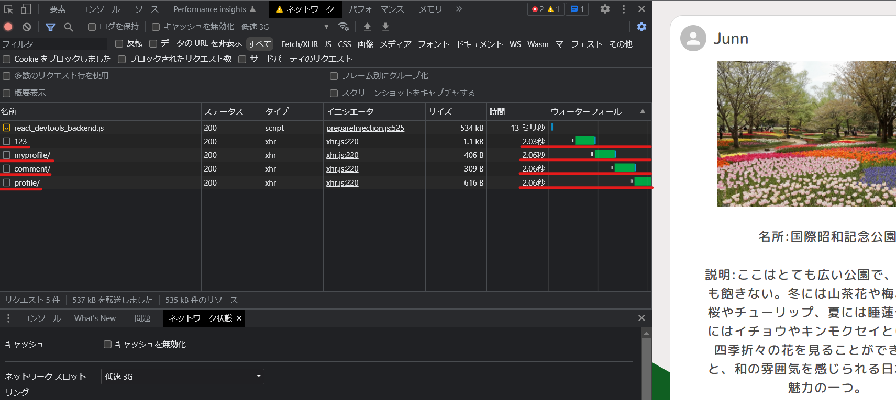
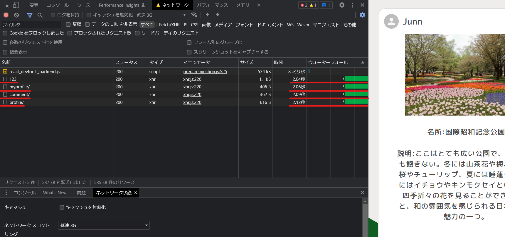

# 名前
Map Collection

# 説明
このアプリはユーザーが名所だと思った場所を紹介するためのアプリです。

## このアプリは12/8にアップデートを行いました。以下が主な変更点です v.1.10
1. ソート機能(新規投稿順とアクセスが良い順、混雑が少ない順に表示できるようにしました。)
2. タグ機能
3. レイアウト、フォント変更(白色を基調にして、少し落ち着いた感じにしました。また、フォントもcreate-react-appに付いているデフォルトのものからゴシック体に変更しました。)

## このアプリは1/25にライブラリの追加、変更を行いました。以下が主な変更点です。 v1.11
1. 投稿した画像を圧縮してくれるライブラリ(browser-image-compression)を採用しました。
2. ページネーション機能をバックエンド側(Django Rest Framework)とフロントエンド側(React.js)の両方に追加しました。元々、ページネーションの機能自体はReact.jsのライブラリを使って実装していたのですが、レスポンスの負荷を減らすものではありませんでした。そこで負荷を少なくしようと、バックエンド側とフロントエンド側の両方を修正することにしました。

## このアプリは2/1にアップデートを行いました。以下が主な変更点です。  v1.12
1. 投稿画面、編集画面でタグを取り消すための、「×」ボタンの位置を修正しました(タグの文字と「×」の位置を離した)。
2. ページネーションのロジックをカスタムフック化しました。
3. ページネーションに関して、自身がみているページを濃い色で示すようにしました(それまでは、自分が何ページを見ているかが分かりにくかったので)。

## このアプリは2/11にアップデートを行いました。以下が主な変更点です。 v1.13
1. 新規登録する際の「Register」ボタン、ログインする際の「Login」ボタンを押して、投稿一覧やプロフィールのデータをバックエンドから取得する際のローディングアニメーションをを変更。
2. 投稿の詳細ページにアクセスした際のローディングアニメーションを追加。
3. 2.で記述した変更に伴って、詳細ページのテストを一部変更しました。
4. タグを追加したとき、タグの入力欄が空文字になるよう修正。 
5. データを取得するため、バックエンドへのデータの受け取りを並列化(Promise.allを使用)しました。この点は文章では分かりずらいと思いますので、少し詳しく説明させてください。先日、このアプリを使ってもらって、意見をくれる友人から、「投稿の詳細ページへ飛んだ時、たまに若干ラグを感じる」と言われました。そこでGoogle Chromeのデベロッパーツールのネットワークタブを開き、「低速3G」でエミュレートして、計測してみました。この画像が変更前の結果です。

赤で線を引いている箇所がバックエンド側からデータを受け取っているところです。1つのURLにつき、おおよそ2秒かかっていることが分かります。この詳細ページでは4つのURLからデータを受けとっているので、詳細ページが描写されるまで、2 × 4、つまり合計8秒程度かかってしまっています。あくまで、「低速3G」の際の結果でありますが、詳細ページへアクセスする度に、長くユーザーを待たせるのは望ましくないため、その待機時間を減らすことにしました。そこで、Promise.allを使用することにしました。つまり、今までは一つのURLへアクセスし、データを受け取り終わってから、次のURLへアクセスしてデータを受け取っていたところを、同時に複数のURLへアクセス、データを受け取ることができるように変更しました。以下がその結果です。

この結果から、一つのURLへデータを受けとるためにおおよそ2秒かかっているのは変更前と変わりませんが、Promise.allで書き換えたことで、同時に風数のURLへデータを受け取ることが可能になりました(「ウォータフォール」と書かれている欄を見れば分かると思います)。結果的に、変更前は8秒程度かかっていた状態から、2秒程度に短縮され(低速3Gでエミュレート時)、ユーザーの待機時間が減少しました。また、詳細ページ以外にも、複数のURLへアクセスしてデータを受けとるページに関しては同様にPromise.allで並列化されるように変更しました。

## このアプリは3/24にアップデートを行いました。以下が主な変更点です。  v1.14
1. ログイン状態でなくても、投稿とコメントが見られるように変更しました。
2. ソート機能を使う際の不具合を修正しました。(投稿全体がソートされず、そのページ内の投稿のみでソートされてしまっていたのを修正しました。)
3. Coreコンポーネントからナビゲーションバーを作るコンポーネントを分離することにしました。そうした方が必要な箇所にのみ再レンダリングされるようになりますし、可読性も改善されるので。

## このアプリは3/25にアップデート行いました。以下が主な変更点です。  v1.15
1. 自身が投稿したコメントを削除できるように変更しました

# 機能一覧
simplejwt djoserというライブラリを使ったjwt認証機能

ユーザー情報編集機能

投稿表示機能

新規投稿機能

自身の投稿の編集・削除機能

コメント機能

公開後もアップデートを行い、機能を追加する予定です

# URL
### https://mapcollection.tk

# 主に使用した技術一覧
Node.js 16

React.js 18.1.0

Python 3.7

Django 3.0.7

django-rest-framework 3.10

MySQL 5.7.38

Nginx

Gunicorn

Docker/Docker-compose

# テスト
バックエンド:unittest

フロントエンド:react-testing-library + Jest

# ER図

# AWS

概要だけ説明すると、バックエンドはECS(Fargate)で、フロントエンドの方はS3とCloudFrontで、データベースはRDSを使って構成しました

