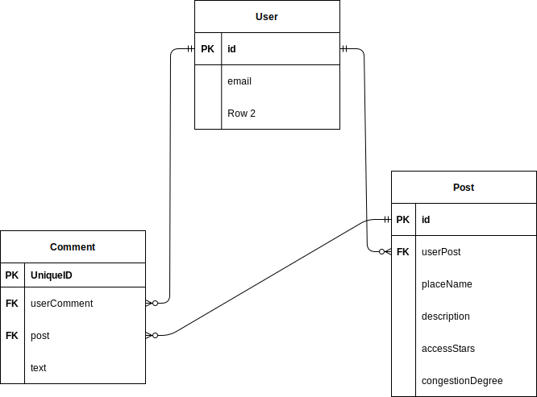

# 名前
Map Collection

# 説明
このアプリはユーザーが名所だと思った場所を紹介するためのアプリです。

## このアプリは12/8にアップデートを行いました。(少し、忙しくてReadmeを編集するのを忘れてました<(_ _)>)。以下が主な変更点です
1. ソート機能(新規投稿順とアクセスが良い順、混雑が少ない順に表示できるようにしました。)
2. タグ機能
3. レイアウト、フォント変更(白色を基調にして、少し落ち着いた感じにしました。また、フォントもcreate-react-appに付いているデフォルトのものからゴシック体に変更しました。)

#デモ

後で貼ります

# 機能一覧
simplejwt djoserというライブラリを使ったjwt認証機能

ユーザー情報編集機能

投稿表示機能

新規投稿機能

自身の投稿の編集・削除機能

コメント機能

公開後もアップデートを行い、機能を追加する予定です

# URL
### https://mapcollection.tk

# 主に使用した技術一覧
Node.js 16

React.js 18.1.0

Python 3.7

Django 3.0.7

django-rest-framework 3.10

MySQL 5.7.38

Nginx

Gunicorn

Docker/Docker-compose

# テスト
バックエンド:unittest

フロントエンド:react-testing-library + Jest

# ER図

# AWS

概要だけ説明すると、バックエンドはECS(Fargate)で、フロントエンドの方はS3とCloudFrontで、データベースはRDSを使って構成しました

